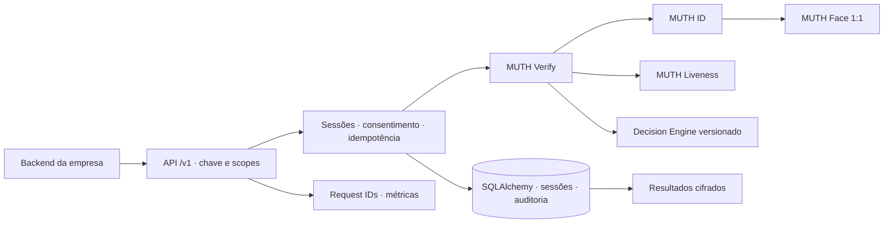
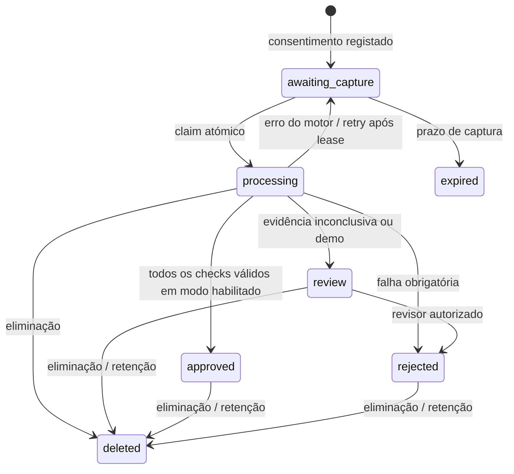

# MUTH — System Design Document

Versão 1.6 · 3 de Outubro de 2026 · Plataforma/biometria, OCR e captura ao vivo v0.7.

O desenho biométrico vigente está em [biometrics-SDD.md](biometrics-SDD.md).
As extensões substituem as referências históricas abaixo a motores ainda demo:
Face/Liveness reais, OCR Tesseract local e calibração supervisionada estão
integrados. Registos faciais autorizados permitem comparação posterior 1:1,
mantendo identidade provisória e `authenticated=false`. Autenticidade documental,
protocolo de login e precisão local/prontidão comercial continuam por demonstrar.
O [refinamento do backend](backend-refinement.md) define os requisitos adicionais
de admissão, cancelamento, transacções, integridade e avaliação por imagem.
O [SDD de captura](capture-SDD.md) acrescenta interface mobile/web, frente/verso,
selfie, capabilities do browser e uma nota preliminar explicitamente limitada.
O [SDD de aprendizagem web](web-learning-SDD.md) define OCR, consentimentos
independentes, fila de revisão, templates cifrados e reutilização provisória.
O [SDD de recuperação documental](ocr-recovery-SDD.md) acrescenta isolamento do
cartão, perspectiva, OCR por coordenadas e avaliação privada de fotografias reais.
O [SDD de câmara ao vivo](live-camera-SDD.md) define detecção, estabilidade,
fotogramas transitórios autorizados e captura automática com revisão final.
O [mapa de páginas e perfis](product-pages-SDD.md) organiza 30 páginas propostas
e a ordem de implementação dos portais de utilizador, empresa e administração.
É normativo para os contratos v0.7; o diagnóstico e plano P0 abaixo conservam o
histórico da fundação, sem declarar os gates comerciais cumpridos.

## 1. Objectivo e limites

Construir infraestrutura B2B de verificação de identidade, começando por BI angolano
e selfie, com evidência rastreável e reutilização futura mediante autorização.
Os compradores iniciais são fintechs, pagamentos e serviços digitais que precisam
de onboarding e recuperação de conta. Esta é uma hipótese comercial a validar em
pilotos; não há procura, contratos ou cobertura documental comprovados neste projecto.

O resultado desta iteração é uma **fundação de engenharia profissional**, não um
serviço biométrico certificado. O pacote P0 definido abaixo será implementado e
verificado nesta iteração. P1–P3 têm gates explícitos porque dependem de pesos
licenciados, dados consentidos, integração de captura e avaliações independentes.
Nenhuma funcionalidade futura deve aparecer como disponível no readiness ou na API.

Referências: [mercado](market-analysis.md), [repositórios](repository-assessment.md),
[fontes verificadas](research/sources.json). Alegações de fornecedores não são
resultados de benchmark MUTH.

## 2. Diagnóstico da base v0.1

| Observação | Consequência | Acção P0 |
| --- | --- | --- |
| IDs sem persistência | Impossível consultar ou auditar uma verificação | Sessões e resultados em SQLAlchemy |
| API key global opcional | Ausência de fronteira entre empresas | Chaves obrigatórias, tenant derivado da chave, scopes |
| Ausência de consentimento | Processamento sem evidência da autorização recebida | Consentimento versionado e propósito obrigatório |
| Motores demo instanciados nas rotas | Substituição inconsistente de providers | Bundle único de engines injetado na aplicação |
| Sem idempotência nem estado | Repetições podem gerar decisões diferentes | Chave + fingerprint + claim transaccional |
| Sem retenção nem eliminação | Ciclo de vida incompleto | TTL, resultado cifrado, eliminação e purge |
| Upload validado depois do parsing | DoS por multipart antes da validação | Limite de corpo ASGI + tamanho e resolução por imagem |
| Sem auditoria ou operação | Incidentes difíceis de reconstruir | Eventos, request ID, métricas, migrações e CI |

## 3. Posicionamento e estratégia de construção

Persona enfatiza fluxos configuráveis; Veriff, captura e sinais antifraude; Jumio e
Entrust combinam verificação e autenticação; Sumsub reúne operações de compliance;
Smile ID já combina especialização local africana, biometria e fontes oficiais.
MUTH deve ganhar por qualidade documentada num mercado inicial e facilidade de
integração. Não prometer equivalência, melhor precisão ou menor preço sem avaliação.

**Construir:** contratos, workflow, política de decisão, versionamento, ciclo de vida,
integração para empresas, normalização de BI, benchmarks locais e motivos explicáveis.
**Integrar:** SQLAlchemy, Alembic, cryptography, Prometheus e motores validados.
**Comprar ou contratar quando necessário:** referência de liveness, fontes oficiais,
auditoria independente e screening AML. OCR não fornece autenticidade documental.

Não introduzir microserviços, Kubernetes, motor de busca 1:N ou múltiplos OCRs em
produção nesta fase. O monólito modular permite mudar os adapters antes de aumentar
o custo operacional. Temporal passa a candidato quando existir processamento
assíncrono durável com filas, tentativas e fornecedores externos.

## 4. Arquitectura

As chaves B2B nunca entram no browser do utilizador. A captura web usa capabilities
limitadas à sessão; guardar um perfil exige consentimento e capability próprios.
OCR corre localmente, sem enviar documentos para terceiros. Atestação e sinais
avançados do dispositivo continuam em P2. Um ficheiro enviado não prova presença
fresca nem vinculação criptográfica à câmara.

### Separação de responsabilidades

- `domain`: schemas de evidência, sessão, consentimento e estado.
- `engines`: contratos e bundle; nenhum adapter real é seleccionado implicitamente.
- `services`: orquestração, política e fingerprint de tentativa.
- `storage`: transacções, isolamento por tenant, cifragem e auditoria.
- `security`: principal derivado da chave e autorização por scopes.
- `middleware`: limite de corpo, rate limit local e request ID.
- `evaluation`: manifesto de modelos e medição offline.

## 5. Modelo de dados

**Session:** ID aleatório, tenant, estado, criação, prazo de captura, retenção,
consentimento/subject cifrados, resultado cifrado, hash de chave de idempotência,
fingerprint da captura, token da tentativa e prazo do claim.

**AuditEvent:** ID, tenant, sessão, evento, actor (identificador interno da chave),
timestamp, request ID. Não contém nomes, números de BI, ficheiros ou scores.
É append-only pela API; um administrador da base de dados pode alterá-lo.
Não anunciar auditoria imutável. Ancoragem externa e export assinado são P2.

**CaptureLearningCandidate:** ID/sessão/tenant, estado, retenção e payload cifrado
com scores/fingerprints, extracção/propostas OCR e revisão. Sem imagens ou vectores.
O estado pending_review não gera LearningSample. Operador `capture_review` declara
labels independentes e referências pseudónimas estáveis; o frontend não os escolhe.

**IdentityProfile:** ID aleatório, tenant, sessão de origem, retenção e estado
provisório; payload cifrado com embedding normalizado de 128 valores, fingerprint
do modelo, dados documentais e consentimento específico. Respostas públicas nunca
incluem vectores; comparação usa o mesmo fingerprint e recebe uma nova selfie.
Por defeito, perfil retido 365 dias, independentemente do prazo normal da sessão.
`identity_max_profiles` (`MUTH_IDENTITY_MAX_PROFILES`) limita a 10 000 perfis
activos por tenant; quota e inscrição são verificadas na mesma transacção.
Delete explícito da sessão apaga perfis derivados; expiração normal só limpa a sessão.

**DocumentData:** campos extraídos, origem/confiança, conflitos, checks MRZ e
`processing_version=muth-document-ocr-v2`. PSM 6 é a primeira leitura; PSM 11
é uma segunda leitura adaptativa perante campos insuficientes/invalidade,
conservando incerteza quando duas leituras plausíveis discordam.

SQLAlchemy com SQLite persistente é a referência local; transacções usam operações
condicionais para claim e finalização. Alembic versiona o schema. PostgreSQL é
evolução prevista, mas só será anunciado suportado após testes nesse dialecto.
Sem imagens persistidas pela aplicação. Embeddings só existem no perfil cifrado
autorizado; nenhuma resposta, log ou métrica inclui estes vectores. Multipart/OCR
podem usar ficheiros temporários; o operador deve considerar tmpfs, cifragem de
disco e limpeza de temporários. Migração corrente: `0005_identities`.

## 6. Estados e concorrência

Um lease protege a tentativa. A finalização exige o mesmo token do claim;
uma resposta atrasada não pode sobrescrever uma tentativa nova nem ressuscitar
uma sessão eliminada. Um resultado concluído com a mesma chave e fingerprint é
reutilizado; mesma chave com payload diferente recebe 409. Tentativa concorrente
recebe 409; retries não geram novo ID de verificação. Chaves são válidas no âmbito
de tenant + sessão. O fingerprint usa HMAC, enquadramento de comprimentos e bytes
das imagens; nunca uma lista pública de hashes biométricos.

## 7. Contrato HTTP

| Método e recurso | Scope | Comportamento |
| --- | --- | --- |
| `POST /v1/sessions` | `verify` | Consentimento obrigatório; retorna sessão |
| `GET /v1/sessions/{id}` | `read` | Sessão e resultado persistido; outro tenant recebe 404 |
| `POST /v1/sessions/{id}/verify` | `verify` | Multipart + `Idempotency-Key`; claim, decisão, persistência |
| `POST /v1/sessions/{id}/review` | `review` | Rejeição manual com motivo; nunca aprovar demo |
| `DELETE /v1/sessions/{id}` | `delete` | Elimina payloads; tombstone e auditoria mínima |
| `GET /v1/sessions/{id}/events` | `audit` | Lista limitada de eventos sem dados pessoais |
| `POST /v1/verifications` | `verify` | Compatibilidade: fluxo efémero demo; não cria sessão |
| `POST /v1/faces/compare` | `verify` | Comparação 1:1 via bundle |
| `POST /v1/liveness` | `verify` | Check via bundle |
| `POST /v1/documents/analyze` | `verify` | Check documental via bundle |
| `POST /v1/auth/authenticate?identity_id=...` | `capture_review` | Selfie contra perfil provisório; sempre authenticated=false |
| `GET /v1/capture-learning`, `/status`, `POST /refine`, `/{id}/review` | `capture_review` | Revisão global do tenant reservado; labels independentes |
| `GET/DELETE /v1/capture-identities/{id}` | `capture_review` | Gestão de perfis do portal por operador |
| `GET /metrics` | `metrics` | Métricas sem tenant, sujeito, sessão ou dados biométricos |

Erros seguem `{error: {code, message}, request_id}`. 401: credencial ausente/inválida;
403: scope insuficiente; 404: recurso inexistente/inacessível; 409: conflito de
estado/idempotência; 410: captura expirada; 413: tamanho; 415: formato; 422: schema;
429: limite local; 503: motor/schema indisponível. Validação nunca devolve os
valores recebidos de campos potencialmente sensíveis.

As rotas `/capture-api` e `/identity-api` usam Bearer separado das chaves acima;
contratos completos estão nos SDD específicos. `capture_review` é scope
administrativo global explícito, não concedido à chave legacy nem por `muth init`.

## 8. Confiança, decisão e dados biométricos

Outcomes de cada check: `pass`, `fail`, `inconclusive`; incluir provider, versão do
modelo e motivos. Na política base, uma falha obrigatória rejeita; incerteza pede
revisão; todos os checks pass permitem aprovação apenas fora do modo demo.
Não misturar scores de liveness, similaridade e documento numa média 0–100.

O modo demo permanece sempre `review`, mesmo se um adapter de teste devolver pass.
Review manual P0 só permite rejeitar; aprovação exige evidência real e governança
que ainda não existem. Readiness declara `identity_verification_ready=false`.

Manifestos de pesos devem identificar versão, checksums SHA-256, ficheiros locais,
termos de utilização e evidência da revisão de licença. O comando de validação
confirma integridade e presença documental; não emite parecer jurídico. Não
descarregar pesos automaticamente nem usar um threshold genérico como calibrado.

## 9. Segurança e privacidade

- Tenant é derivado da API key de alta entropia, verificada contra SHA-256 configurado;
  não confiar num `tenant_id` fornecido pelo cliente. Comparação em tempo constante.
- Consentimento registado evidencia a declaração recebida do backend da empresa;
  não prova, por si só, a interface apresentada ou a vontade do utilizador.
- Scopes por chave; rotação configura duas chaves temporariamente e remove a antiga.
- Fernet da biblioteca `cryptography` cifra consentimento/subject, resultado,
  fila de aprendizagem e perfil facial autorizado.
  A chave persistente é fornecida pelo operador; dados em memória podem usar chave efémera.
- Eliminação limpa dados cifrados, fingerprint e idempotência. Backups seguem a
  retenção do operador; apagar uma linha não apaga automaticamente backups antigos.
- Novos uploads expiram em 30 minutos por defeito. Retenção B2B: 30 dias;
  portal: resultado 1 dia ou 30 dias com contribuição; perfil: 365 dias.
  Worker do portal limpa periodicamente; operações B2B seguem o runbook de purge.
  Acesso após retenção é recusado mesmo antes da limpeza física.
- Chaves e `.env` ficam fora do controlo de versões; bootstrap grava `.env` com modo 0600.
- Corpo limitado antes do parser; validação de imagem em thread; API key e scopes
  verificados antes de consumir uploads. Sem CORS aberto.
- Rate limit por chave em memória, adequado a um processo local; limite partilhado
  de gateway/Redis é gate para múltiplas réplicas.
- Sem transmissão de dados a serviços de terceiros nesta implementação.

### Ameaças e controlos

| Ameaça | Controlo P0 | Limitação restante |
| --- | --- | --- |
| IDOR entre empresas | tenant em todas as queries; testes de 404 | Testar também PostgreSQL antes de migração |
| Replay de chamadas | idempotência e estado | Não prova frescura da captura |
| Ressurreição após delete | token de claim e update condicional | Backup exige processo próprio |
| Foto/tela/deepfake | PAD RGB integrado, abstention e limiares não calibrados inconclusivos | Sem garantia PAD/IAD local nem defesa completa de injection |
| Vazamento em logs/erros | códigos e request IDs sem payload | Observabilidade externa precisa de revisão |
| Abuso de upload | corpo, pixels, formato e rate limit | Proxy, TLS e quotas distribuídas são do operador |
| Peso não licenciado/modificado | manifesto, checksum e revisão de licença | Auditoria de cadeia de fornecimento P1 |

## 10. Operação e entrega

Migração antes de servir DB persistente. Health verifica processo; readiness verifica
schema e modo. Métricas: contagem e duração por rota templated/status, evitando
cardinalidade e identificadores pessoais. Request ID gerado no servidor para cada
pedido e devolvido no header e erros. Não confiar no ID fornecido pelo cliente.

Dockerfile de referência não-root e CI com dependências bloqueadas, lint, testes,
build do pacote e verificação de migração. Container e publicação não são executados
implicitamente. Runbook cobre backup, restore, rotação, purge e recuperação de lease.

## 11. Avaliação e objectivos

Ferramenta offline recebe CSV de pares avaliados por modelo e calcula FMR/FNMR,
intervalos Wilson, latência p50/p95 e cortes por grupo. O CSV contém labels,
scores e latência; não precisa de imagens, nomes ou números de documentos.
O limiar é fixado por um conjunto de calibração separado e só então aplicado no teste.
Liveness exige relatório APCER/BPCER por ataque; OCR, exact match por campo, CER,
qualidade de imagem e versão de BI. Não extrapolar resultados de pares faciais para PAD.

Objectivos iniciais para negociação do piloto, **ainda não medidos**:

- p95 de operação da plataforma sem inferência < 500 ms numa configuração definida.
- p95 da verificação completa < 10 s na configuração de hardware a documentar.
- Relatório de FMR/FNMR com intervalo de confiança e análise de amostras insuficientes.
- Disponibilidade comercial alvo 99,9% só após monitorização e operação redundante.
- Nenhum gate de produção pode passar apenas com demo ou imagens sintéticas.

## 12. Plano de execução e rastreabilidade

| ID | Requisito P0 | Evidência esperada |
| --- | --- | --- |
| P0-01 | Sessões, consentimento e resultado persistente | Teste create→verify→read e restart |
| P0-02 | Tenant e scopes obrigatórios | Testes entre empresas e 401/403 |
| P0-03 | Idempotência e claim atómico | Replay, conflito, concorrência e lease |
| P0-04 | Cifragem, TTL, delete e purge | Inspecção de DB e teste de eliminação |
| P0-05 | Auditoria e rejeição manual | Eventos sem payload e scopes de revisor |
| P0-06 | Bundle substituível sem aprovação demo | Provider injection e motor indisponível |
| P0-07 | Limites, erros e observabilidade | Testes de body stream, request ID e métricas |
| P0-08 | Migração, bootstrap, CI e runbook | Alembic up/down/up, build e comandos documentados |
| P0-09 | Manifestos e benchmark offline | Checksum inválido, licença ausente e métricas conhecidas |

**P1 — piloto algorítmico:** adapters reais, pesos licenciados, dataset consentido,
benchmark face/liveness/OCR e revisão dos thresholds. Gate: relatório reproduzível.
**P2 — integração comercial:** captura vinculada à sessão, antifraude de canal,
review completa, webhooks assinados com outbox/retry, rate limit partilhado e
PostgreSQL validado. Gate: piloto end-to-end e pentest.
**P3 — MUTH Auth e expansão:** passkeys, recuperação, autorização de reutilização,
templates versionados e novos países. Gate: protocolo e direitos dos dados validados.

O relatório [implementation-status.md](implementation-status.md) deve indicar o
que foi implementado, testes executados e gates que continuam abertos.
