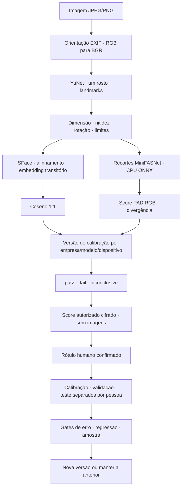

# MUTH — motores biométricos e aprendizagem

SDD 1.1 · 2 de Outubro de 2026 · implementação v0.3.0.
Extensão do [SDD da plataforma](SDD.md); prioridade exclusiva: Face e Liveness.

## 1. Resultado pretendido

Motores locais, substituíveis e reproduzíveis, com controlo de qualidade e uma
aprendizagem supervisionada que melhora decisões quando existe evidência.
Cada verificação autorizada acrescenta um score observado; só um rótulo confirmado
o transforma em exemplo de calibração. Não há promessa de melhoria a cada chamada.
As previsões do próprio motor nunca são usadas como verdade.

Nesta versão, a aprendizagem automática **recalibra limiares**, sem alterar pesos
das redes. Treinar redes próprias exige um dataset de imagens separado, direitos
de treino, gestão de eliminação e avaliação independente. A API não guarda imagens
ou embeddings, pelo que não pode fazer esse treino implicitamente.

## 2. Escolha dos motores

| Camada | Implementação | Motivo e limite |
| --- | --- | --- |
| Detecção/landmarks | YuNet ONNX, OpenCV Zoo | CPU, cinco pontos; qualidade não garante que todos os rostos sejam detectados |
| Alinhamento/embedding | SFace ONNX, OpenCV FaceRecognizerSF | Integração directa 1:1; 128 dimensões normalizadas, sem busca global |
| PAD RGB | MiniFASNetV2 + MiniFASNetV1SE, ONNX Runtime CPU | Dois recortes, 2,7× e 4×; média das probabilidades da classe live |
| Orquestração | MUTH | Qualidade, thresholds, abstention, versões, feedback, retenção e decisão |

Os pesos pré-treinados InsightFace continuam candidatos ao laboratório; não foram
usados para contornar os seus termos de utilização. A escolha actual permite uma
implementação local com fontes e licenças identificadas. Isto não prova que SFace
supera ArcFace ou fornecedores comerciais.

OpenCV Zoo commit `47534e27c9851bb1128ccc0102f1145e27f23f98`:
[YuNet](https://github.com/opencv/opencv_zoo/tree/47534e27c9851bb1128ccc0102f1145e27f23f98/models/face_detection_yunet)
declara MIT para a pasta;
[SFace](https://github.com/opencv/opencv_zoo/tree/47534e27c9851bb1128ccc0102f1145e27f23f98/models/face_recognition_sface)
declara Apache 2.0 para a pasta. Silent-Face commit
`b6d5f04ad78778917853b25c778acef6d5626d15`:
[fonte](https://github.com/minivision-ai/Silent-Face-Anti-Spoofing/tree/b6d5f04ad78778917853b25c778acef6d5626d15),
Apache 2.0 no repositório. Licenças e avisos preservados em `vendor/`.
Manifesto local declara **research**: não é uma aprovação jurídica comercial.

## 3. Fluxos e contratos de inferência

Valores iniciais de qualidade: face ≥60 pixels, variância Laplaciana ≥15,
roll ≤30°, detector ≥0,9; detecção limitada a 960 pixels na maior dimensão.
São regras iniciais versionadas, ainda não optimizadas para câmaras angolanas.
Sem rosto, múltiplos rostos detectados, face truncada, blur, pose inadequada ou
output inválido produzem inconclusivo. Divergência de liveness >0,5 também abstém.

MiniFASNet recebe **BGR float32 com valores de 0 a 255**, tensor `[1,3,80,80]`.
Não dividir por 255: a implementação original de `ToTensor` não normaliza.
Classe live: índice 1. Softmax separado de cada modelo, depois média.
Exportação CPU opset 17; PyTorch apenas na preparação, `weights_only=True`.
O servidor carrega ONNX verificado e não executa pickle nem downloads.

`score_kind=cosine_similarity` tem intervalo [-1,1]; `liveness_softmax` [0,1].
Nenhum é uma probabilidade de identidade ou certificado antifraude.
Cada Check expõe fingerprint de pesos/preprocessamento/qualidade, versão de
calibração, threshold e diagnósticos numéricos. Embeddings não saem do motor.
Baseline facial 0,363 e PAD 0,8 **não habilitam pass/fail** sem calibração validada.

O extractor de retrato permite exercitar a comparação com uma foto documental;
o check documental fica inconclusivo. OCR e autenticidade não foram implementados
nesta iteração. A flag `identity_verification_ready` permanece `false`;
readiness da inferência biométrica é independente.

## 4. Dados, autorização e confirmação

- `learning_opt_in=false` por defeito, separado do consentimento de verificação.
- Opt-in exige `subject_reference` estável, pseudónima, atribuída pelo backend.
- Apenas sessões persistentes biométricas recolhem scores; chamadas efémeras e demo não aprendem.
- Score vem do resultado interno, nunca do pedido de feedback.
- Score, label, grupo de dispositivo e referência de revisão ficam cifrados.
- HMAC com subchave e tenant torna referências de pessoa pseudónimas; não há pooling entre empresas.
- Feedback exige scope `feedback` e origem `human_review`. `official_verified` é recusada
  até existir integração efectiva; uma string no pedido não verifica uma fonte oficial.
- Rótulos são imutáveis: repetição idêntica é idempotente; conflito recebe 409.
- Face impostor exige identidade da captura confirmada e diferente da referência.
- Liveness spoof exige classe de ataque. Injection/other não entram na calibração RGB.
- O backend cliente deve oferecer ao revisor evidência independente do score.
  A MUTH regista a declaração; não prova que o revisor disse a verdade.

Migração `0002_learning`: amostras, versões, ponteiro activo e membros do dataset.
Resultado e recolha de score pertencem à mesma transacção; replay não duplica dados.
Guardar scores não autoriza guardar imagens para treino de redes.

## 5. Separação e promoção automática

Partição determinística pelo HMAC da pessoa: 60% calibração, 20% validação,
20% teste. Par impostor só participa se os dois sujeitos pertencem à mesma
partição. Recapturas não aumentam artificialmente a amostra: um par por label/
ataque e participantes sem repetição dentro desse estrato. Novos pesos ou
preprocessamento recebem fingerprint novo e começam sem calibração validada.

| Gate predefinido | Critério |
| --- | --- |
| Calibração | ≥50 exemplos independentes por classe |
| Validação e teste | ≥400 por classe, separadamente |
| Falso aceite | Limite superior Wilson bilateral 95% ≤1% |
| Falsa rejeição | Taxa ≤10% |
| Grupos de dispositivos declarados | Mesmos mínimos e limites por grupo observado |
| PAD | APCER por print/screen_replay/mask observado; BPCER em bona fide |
| Regressão | Nenhuma taxa piora nos grupos de validação/teste |
| Versão seguinte | Melhoria mensurável; empate conserva a anterior |
| Uso do teste | Máximo 5 avaliações por fingerprint/tenant/role; novos exemplos não reiniciam o orçamento |
| Consentimento/retenção | Todos os exemplos usados continuam autorizados e disponíveis |

Threshold é escolhido **só na calibração**, minimizando falsa rejeição entre
candidatos com falso aceite empírico aceitável. Validação e teste apenas aprovam
ou bloqueiam; não escolhem o threshold. O painel de teste usa os primeiros N
exemplos por classe/dispositivo/ataque. O orçamento limita ajustes ao holdout;
não torna tentativas repetidas estatisticamente independentes.
Wilson pressupõe independência; estes gates são protecções de laboratório,
não certificação nem garantia de erro futuro ou de 95% simultâneo entre grupos.
Dados de população, país e condições de captura não observados exigem avaliação própria.

FMR/FNMR em face, APCER/BPCER em PAD. Relatórios incluem denominadores, contagens,
taxas, limite superior e motivos de bloqueio. Não anunciar “99% de precisão” a
partir desses gates. Grupo conhecido que não passou validação+teste usa baseline
inconclusiva. Grupo unknown só usa avaliação global, sem alegação por dispositivo.

Worker periódico local: `MUTH_LEARNING_INTERVAL_SECONDS=300`; scope `learning`
permite execução imediata. Sem labels/minimum, devolve collecting. Versões e
relatórios são imutáveis; promoção altera o ponteiro activo. SQLite usa
`BEGIN IMMEDIATE` na calibração/feedback/rollback e lock por processo. Adequado
ao piloto local; não é uma fila de treino distribuída nem uma garantia de SLA.

## 6. Eliminação, rollback e operação

Retirar consentimento conserva a verificação, apaga os exemplos e revoga versões
dependentes. Delete de sessão e purge fazem o mesmo na sua transacção. Um exemplo
expirado invalida uma versão já na leitura, antes do purge. O ponteiro volta à
baseline inconclusiva; rollback só aceita versão passed, da mesma empresa/modelo,
com todos os membros disponíveis. Não permite ressuscitar dados apagados.
Backups, ficheiros de datasets externos e relatórios exportados exigem retenção própria.

| Recurso | Scope |
| --- | --- |
| `POST /v1/sessions/{id}/feedback` | feedback |
| `DELETE /v1/sessions/{id}/learning-consent` | delete |
| `GET /v1/learning` | learning |
| `POST /v1/learning/refine` | learning |
| `POST /v1/learning/{face,liveness}/rollback?policy_id=...` | learning |

Revisão de integridade/licenças precede arranque. Pesos em `models/` e resultados
em `data/` ficam fora dos pacotes e do controlo de versões. Dependências de runtime
estão no extra `biometrics`; PyTorch/ONNX de exportação no grupo `export`.
ONNX Runtime tem telemetria desactivada; o aviso de ID não persistido no HOME
restrito foi observado, sem falha de inferência. Servidor não transmite capturas.

## 7. Rastreabilidade e gate de conclusão

| ID | Entrega | Evidência |
| --- | --- | --- |
| B-01 | YuNet/SFace CPU real | Self-match, múltiplas faces, blur, face ausente, API |
| B-02 | MiniFASNet CPU real | Três imagens públicas e paridade Torch/ONNX |
| B-03 | Cadeia de artefactos | Commits/blob/LFS SHA, manifesto, corrupção rejeitada |
| B-04 | Recolha autorizada | Opt-in, demo excluída, replay, dados cifrados |
| B-05 | Labels e separação | Origem oficial recusada, conflitos, sujeitos/empresas/modelos |
| B-06 | Calibração automática | Amostra insuficiente, promoção, holdout, empate e orçamento |
| B-07 | Ciclo de vida | Withdrawal, delete, retenção, expiração e rollback revogado |
| B-08 | Operação | Migração, lock, worker, API scopes, build e comandos reproduzíveis |

Os motores estão implementados e a inferência foi executada. O gate “refinados
para Angola e completos para produção” **continua aberto**: nenhum dataset local
consentido está disponível. Requer avaliação de pares genuínos/impostores,
dispositivos de entrada, luz, idades e tons de pele com rótulos autorizados,
ataques físicos representativos, testes de canal de captura e comparação com
um fornecedor comercial. Três exemplos públicos e scores sintéticos não fecham o gate.
PAD RGB não resolve captura fresca, deepfake ou injection; máscaras não estão
validadas pelo smoke. Não adicionar OCR/Auth até se fechar o escopo biométrico.
